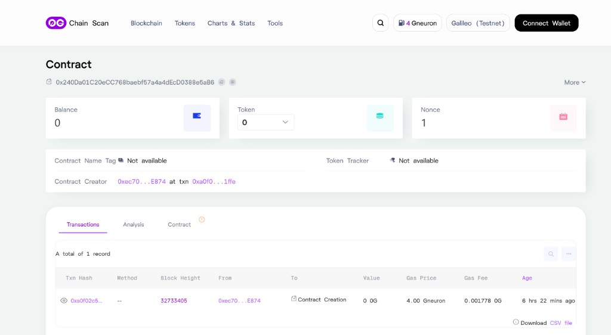
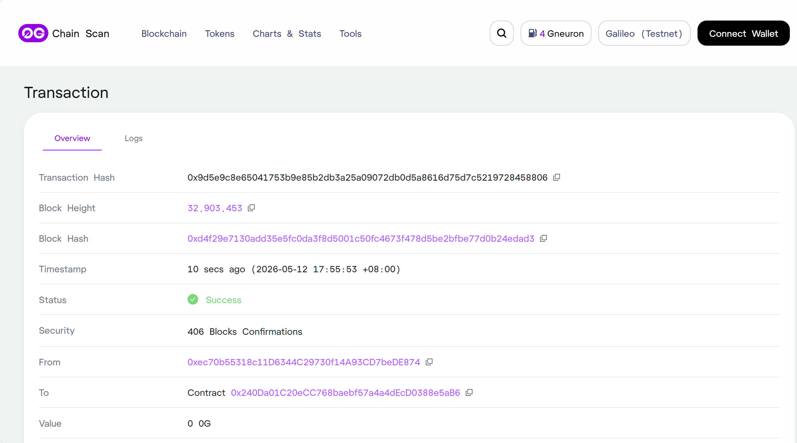
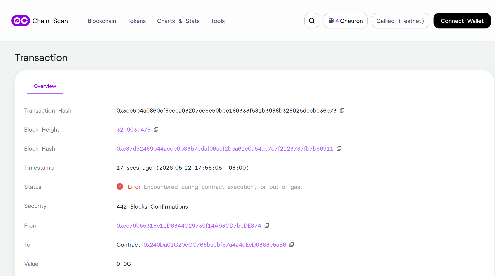
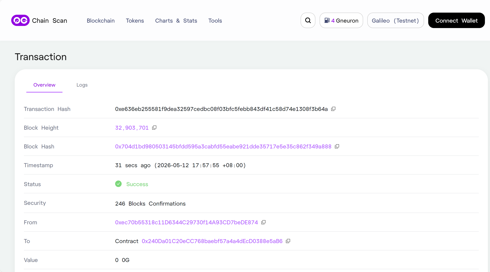
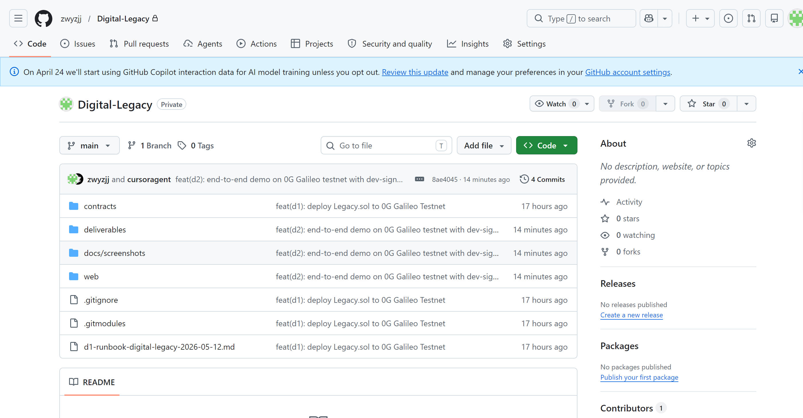

# Digital Legacy — A Dead-Man's Switch on 0G

[🇨🇳 中文](README.md) · **🇬🇧 English**

> **An on-chain dead-man's switch deployed to 0G Galileo Testnet.**
> Deposit your assets, ping to stay alive, and let a designated beneficiary inherit everything if you go silent — no lawyers, no platforms, no trusted third parties. Just code.

[](https://chainscan-galileo.0g.ai)
[](https://chainscan-galileo.0g.ai)
[](https://docs.soliditylang.org/)
[](https://nextjs.org/)
[](#on-chain-end-to-end-verification)

\#0GHackathon · \#BuildOn0G · [@0G_labs](https://x.com/0G_labs)

---

## The Problem

> *"If I die tomorrow, my crypto dies with me."* — Every crypto user, secretly.

There's no native crypto equivalent of a last will. Hardware wallets are sealed black boxes; seed phrases get lost; centralized custodians freeze accounts on death notice. **Self-custody has a single point of failure: you.**

## The Solution

**Digital Legacy** is a single immutable contract that makes "heartbeat + automatic inheritance" an atomic primitive:

- Deposit any amount of OG into a vault.
- Set an **inactivity period** (e.g. one year) and a **beneficiary address**.
- While you're alive, call `ping()` periodically — your on-chain heartbeat.
- If the period elapses with no ping, the beneficiary may call `claim()` to take ownership of the entire balance.
- You can `withdraw()` at any moment before a claim.

No custodians. No platform. The contract *is* the will.

---

## Live Deployment

| | |
|---|---|
| **Contract** | [`0x240Da01C20eCC768baebf57a4a4dEcD0388e5aB6`](https://chainscan-galileo.0g.ai/address/0x240Da01C20eCC768baebf57a4a4dEcD0388e5aB6) |
| **Deployment Tx** | [`0xa0f02c…91ffe`](https://chainscan-galileo.0g.ai/tx/0xa0f02c538115e305cc8e290fd8602ac60eb2c661e17096c16248a3c301a91ffe) |
| **Network** | 0G-Galileo-Testnet |
| **Chain ID** | `16602` *(careful — older 0G docs list `16601`)* |
| **RPC** | `http://evmrpc-testnet.0g.ai` |
| **Explorer** | [chainscan-galileo.0g.ai](https://chainscan-galileo.0g.ai/) |
| **Deployer** | `0xec70b55318c11D6344C29730f14A93CD7beDE874` |
| **Tests** | 3 PASS (`createVault` / `claim too early` / `claim after inactivity`) |

---

## Screenshots

| | |
|:-:|:-:|
|  |  |
| **① Contract deployment verified on Explorer** | **② Create Vault: user deposits 0.01 OG with a 60-second period** |
|  |  |
| **③ Ping: heartbeat signal recorded on-chain** | **④ Claim too early: blocked on-chain (StillActive revert)** |
|  |  |
| **⑤ Claim success: period elapsed, beneficiary inherits** | **⑥ Repository home** |

---

## On-Chain End-to-End Verification

The full lifecycle ran live on 0G Galileo using vault `id = 3`. Each transaction below is a real Explorer link — open the logs tab to see the emitted events:

| Step | Tx Hash | Block | Status | Event |
|---|---|---|---|---|
| **Create Vault** | [`0x0069b5…f92b3e`](https://chainscan-galileo.0g.ai/tx/0x0069b5ecdc88ab1569f273e665793f8e298cd50e6ef707854ea1f89ad9f92b3e) | 32,903,420 | ✅ Success | `VaultCreated(id=3, owner, beneficiary, amount, period)` |
| **Ping** | [`0x9d5e9c…458806`](https://chainscan-galileo.0g.ai/tx/0x9d5e9c8e65041753b9e85b2db3a25a09072db0d5a8616d75d7c5219728458806) | 32,903,453 | ✅ Success | `Pinged(id=3, timestamp)` |
| **Claim too early** (**negative**) | [`0x3ec5b4…be36e73`](https://chainscan-galileo.0g.ai/tx/0x3ec5b4a0860cf8eeca63207ce5e50bec186333f581b3988b328625dccbe36e73) | 32,903,478 | ❌ Revert | `StillActive()` — *guard proves the invariant holds* |
| **Claim success** | [`0xe636eb…f3b64a`](https://chainscan-galileo.0g.ai/tx/0xe636eb255581f9dea32597cedbc08f03bfc5febb843df41c58d74e1308f3b64a) | 32,903,701 | ✅ Success | `Claimed(id=3, beneficiary, amount)` |

The negative and positive `claim` calls are 122 seconds apart (`Pinged @17:55:53 → Claim @17:57:55`, which exceeds the 60-second inactivity period). This proves both halves of the guard logic — "rejected within window" and "accepted after window" — in production conditions.

---

## Core Contract API

```solidity
contract Legacy {
    struct Vault {
        address owner;
        address beneficiary;
        uint256 amount;
        uint256 lastPing;
        uint256 inactivityPeriod;
        bool    claimed;
    }

    function createVault(address beneficiary, uint256 inactivityPeriod)
        external payable returns (uint256 id);

    function ping(uint256 id)     external;   // owner only
    function claim(uint256 id)    external;   // beneficiary, after inactivity
    function withdraw(uint256 id) external;   // owner, anytime before claim

    error NotOwner(); error NotBeneficiary();
    error StillActive(); error AlreadyClaimed();
    error ZeroAmount(); error ZeroAddress();
}
```

Source: [`contracts/src/Legacy.sol`](contracts/src/Legacy.sol) · Tests: [`contracts/test/Legacy.t.sol`](contracts/test/Legacy.t.sol)

---

## Architecture

```
┌─────────────────────────┐         ┌──────────────────────┐
│  Web (Next.js + viem)   │         │  0G Galileo Testnet  │
│  - VaultPanel.tsx       │         │  - Chain ID 16602    │
│  - Dev signer (viem)    │ ──────▶ │  - Legacy.sol        │
│  - /api/rpc proxy       │   tx    │    0x240Da0...e5aB6  │
└──────────────┬──────────┘         └──────────┬───────────┘
               │                               │
               │  JSON-RPC (server-side fetch) │
               └──────────────▶ http://evmrpc-testnet.0g.ai
```

- **`/api/rpc` proxy** ([`web/src/app/api/rpc/route.ts`](web/src/app/api/rpc/route.ts)) — A Next.js route handler that forwards JSON-RPC from the browser to 0G. This sidesteps inconsistent CORS headers on 0G's HTTPS endpoint and the mixed-content trap when the dev server is on `http://localhost`.
- **Dev signer** ([`web/src/lib/dev-signer.ts`](web/src/lib/dev-signer.ts)) — A viem `walletClient` driven by `privateKeyToAccount`, signing transactions client-side and broadcasting via the proxy. Bypasses MetaMask entirely; see *Hard-Won 0G Lessons* below for the why.

---

## Quick Start

### Prerequisites
- Node.js ≥ 20 and pnpm ≥ 9
- (Optional) Foundry (`forge`, `cast`) — only if you intend to redeploy or run the test suite
- A 0G Galileo testnet account funded by the [faucet](https://faucet.0g.ai/)

### 1. Clone and install

```bash
git clone https://github.com/zwyzjj/Digital-Legacy.git
cd Digital-Legacy/web
pnpm install
```

### 2. Configure environment

Create `web/.env.local`:

```env
# Required
NEXT_PUBLIC_LEGACY_ADDRESS=0x240Da01C20eCC768baebf57a4a4dEcD0388e5aB6
NEXT_PUBLIC_CHAIN_ID=16602
NEXT_PUBLIC_RPC_URL=http://evmrpc-testnet.0g.ai
NEXT_PUBLIC_WALLETCONNECT_PROJECT_ID=<from https://cloud.walletconnect.com>

# Dev-mode signing (recommended for the demo; turn off for real wallets)
NEXT_PUBLIC_DEV_SIGNER=true
NEXT_PUBLIC_DEV_PRIVATE_KEY=0x<your testnet private key — NEVER mainnet>
```

> ⚠️ **Security**: `NEXT_PUBLIC_DEV_PRIVATE_KEY` is a hackathon-only convenience for a testnet demo. It is gitignored via `web/.env.local`. Mainnet deployments must remove this path and require a real wallet signature.

### 3. Run

```bash
pnpm dev
# → http://localhost:3000
```

The page exposes three cards: **Create Vault**, **Ping**, and **Claim**. In dev-signer mode the deployer address is shown in the header along with a "Dev Signer" badge.

### 4. Run the contract tests

```bash
cd contracts
forge test -vv
# Ran 3 tests for test/Legacy.t.sol:LegacyTest
# [PASS] testClaimAfterInactivity()
# [PASS] testClaimTooEarly()
# [PASS] testCreateVault()
```

### 5. Redeploy (optional)

```bash
cd contracts
cp .env.example .env   # fill in PRIVATE_KEY
source .env

forge create src/Legacy.sol:Legacy \
  --rpc-url http://evmrpc-testnet.0g.ai \
  --private-key $PRIVATE_KEY \
  --priority-gas-price 2500000000   # 0G enforces min priority fee = 2 gwei
```

---

## Hard-Won 0G Lessons

Five non-obvious gotchas we hit during D1/D2 development. All are already handled in the code; documenting them here so the next builder doesn't lose hours.

### 1. `chainId = 16602`, not the `16601` shown in some older 0G docs
Getting this wrong silently breaks wagmi, MetaMask, and Foundry simultaneously. Verify with:
```bash
cast chain-id --rpc-url http://evmrpc-testnet.0g.ai   # → 16602
```

### 2. **0G Galileo enforces a minimum priority fee of 2 gwei**
Default wallets and CLI tools attach a 1-wei tip, which the mempool silently rejects — **no client-side error is surfaced**. This is by far the most expensive trap we found.

**Fix**: explicitly set `maxPriorityFeePerGas = 2.5 gwei` and `maxFeePerGas = baseFee + 2.5 gwei` on every contract call. See [`web/src/components/vault-panel.tsx`](web/src/components/vault-panel.tsx).

CLI equivalent: `cast send --priority-gas-price 2500000000 ...`.

### 3. **MetaMask 11.x + custom chain → `signal is aborted` and forced `gas = 21000`**
On any unknown chain, MetaMask 11.x's `addDappTransaction` flow aborts its own internal fetch with no reason, **but still broadcasts the tx** with the gas limit hard-overridden to 21000. Contract calls then revert on-chain while the dapp sees only a vague client error. Disabling every MetaMask "smart" feature does not fix it. Reproduced on Brave and Edge.

**Fix**: implement a **dev-signer mode** that builds and signs raw transactions in the browser with viem's `privateKeyToAccount`, then broadcasts via our `/api/rpc` proxy. MetaMask is taken out of the loop entirely.

Production replacement: wallets that work cleanly with custom EVM chains today are Rabby, WalletConnect-based mobile signers, or embedded wallets like Privy.

### 4. **0G's HTTPS RPC has incomplete CORS headers**
Direct browser calls to `https://evmrpc-testnet.0g.ai` intermittently fail with `Failed to fetch`. Server-side forwarding via the Next.js API route fixes this cleanly.

### 5. **`forge create --legacy` does not work on 0G**
0G is EIP-1559 native — passing `--legacy` makes Foundry serialize legacy gas-price fields that the node rejects. Drop the flag.

---

## Repository Layout

```
.
├── contracts/                       # Foundry project
│   ├── src/Legacy.sol               # the contract
│   ├── test/Legacy.t.sol            # 3 PASS
│   ├── script/Deploy.s.sol
│   ├── foundry.toml
│   └── DEPLOYED.md                  # deployment record
├── web/                             # Next.js 16 frontend
│   ├── src/
│   │   ├── app/
│   │   │   ├── page.tsx
│   │   │   └── api/rpc/route.ts     # server-side RPC proxy
│   │   ├── components/
│   │   │   └── vault-panel.tsx      # main UI
│   │   └── lib/
│   │       ├── wagmi.ts
│   │       ├── legacyAbi.ts
│   │       ├── contracts.ts
│   │       └── dev-signer.ts        # viem-based raw signer
│   └── package.json
├── docs/screenshots/                # 01–06
├── deliverables/                    # runbooks + reviews
└── README.md / README.en.md
```

---

## Tech Stack

| Layer | Tooling |
|---|---|
| **Contracts** | Solidity 0.8.24, Foundry, forge-std |
| **Frontend** | Next.js 16, React 19, TypeScript 5, Tailwind v4, shadcn/ui |
| **Web3** | viem 2.x, wagmi 3.x, RainbowKit (optional), EIP-1193 |
| **Network** | 0G-Galileo-Testnet (chainId 16602) |
| **Workflow** | pnpm, ESLint 9, Turbopack |

---

## Roadmap

| Stage | Scope |
|---|---|
| ✅ **MVP (shipped)** | Full lifecycle: `createVault` / `ping` / `claim` / `withdraw`; tests pass; live on 0G; Explorer-verified end-to-end |
| 🚧 **D3** | Demo video (≤ 3 min), public X post, hackathon submission |
| 📋 **D4+** | <ul><li>Encrypt the actual *legacy contents* (text, documents) on **0G Storage**; the contract stores only a hash plus an encryption key released to the beneficiary on claim</li><li>Multiple beneficiaries with split percentages</li><li>Social recovery — n-of-m guardians may trigger inheritance</li><li>Reminder pipeline (Push Protocol / WalletConnect Notify)</li><li>Vault NFT — make a "pending inheritance" a transferable position</li></ul> |
| 🌐 **Mainnet** | Audit, bug bounty, Gnosis Safe integration |

---

## Security Notes

- Deployed **only to 0G Galileo Testnet**, **unaudited**, **not safe for mainnet**.
- `NEXT_PUBLIC_DEV_PRIVATE_KEY` is a hackathon shortcut. Production must rely on user wallets.
- `Legacy.sol` follows checks-effects-interactions (`claim` sets `claimed = true` before the external `call`). No `ReentrancyGuard` is added because the external call is a single one-shot transfer to a pre-validated beneficiary with state already locked — acceptable for a hackathon, but a real deployment should wrap it for defense in depth.
- `ping` has no grace period beyond the user-chosen `inactivityPeriod`; set conservatively.

---

## Credits

- [0G Labs](https://0g.ai) — the modular AI chain + storage stack this project relies on
- [Foundry](https://book.getfoundry.sh/) — the sharpest Solidity toolchain there is
- [viem](https://viem.sh/) — the cleanest TypeScript Ethereum client
- [shadcn/ui](https://ui.shadcn.com/) — a frontend, in an hour

---

## License

MIT © 2026 [zwyzjj](https://github.com/zwyzjj)

---

> Built for **0G Hackathon 2026**. PRs and ideas welcome.
> Repository: <https://github.com/zwyzjj/Digital-Legacy>
